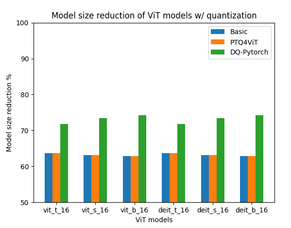
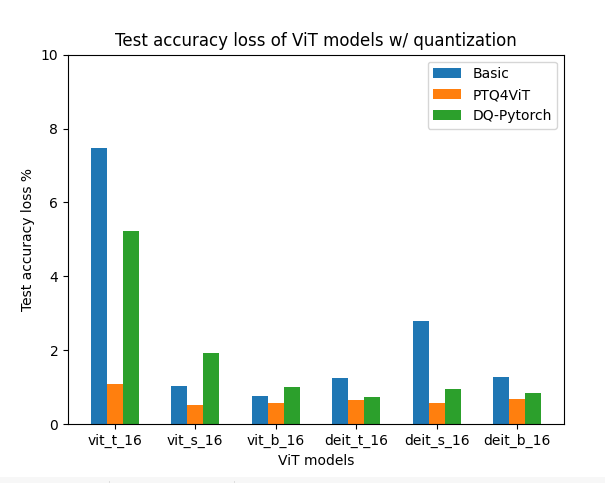
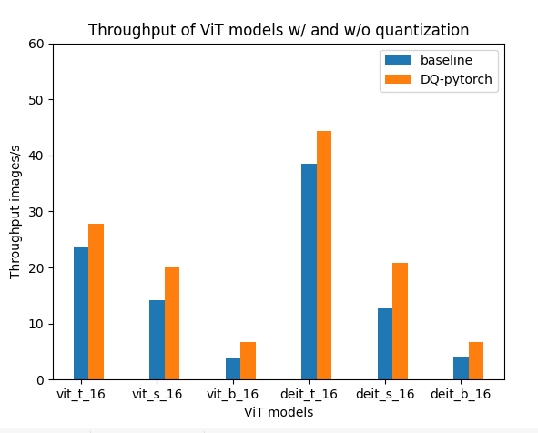

# COMS_6998_Practical_DL_Course_Project

## Project Description

- Use **PTQ4ViT** framework to do post-training quantization on ViT Models
- Use **Pytorch** Dynamic Quantization to do post-training quantization on ViT Models
- Compare Test accuracy and model size achieved by different PTQ methods
- Compare throughput of ViT models with and without dynamic quantization of Pytorch
- Deploy ViT models using tensorflow.js on Github page

## Repository Description

- **configs**,**quant_layers** and **utils** are the main folders that are derived and modified from  **PTQ4ViT** framework
- **test_examples** and **notebook** contain some runnable examples
- **experimental_results** contains the *pt* file generated by the *py* file in **test_examples**

## Run test examples
```
python3 test_examples/test_PTQ.py
python3 test_examples/test_pytorch.py
```

## Results
### Model size(MB) of Basic,PTQ4ViT and Dynamic quantization

|     model    | baseline | Basic  | PTQ4ViT | DQ-Pytorch |
|:------------:|:--------:|:------:|:-------:|:----------:|
| vit-t_16     | 22.92    | 8.32   | 8.32    |  6.46      |
| vit-s_16     | 88.26    | 32.54  | 32.54   |   23.44    |
| vit-b_16     | 346.33   | 128.77 | 128.77  |   89.25    |
| deit_t_16    | 22.92    | 8.32   | 8.32    |   6.46     |
| deit_s_16    | 88.26    | 32.54  | 32.54   |   23.44    |
| deit_b_16    | 36.33    | 128.77 | 128.77  |   89.25    |

### Test accuracy of Basic,PTQ4ViT and Dynamic quantization

|     model    | baseline | Basic  | PTQ4ViT | DQ-Pytorch |
|:------------:|:--------:|:------:|:-------:|:----------:|
| vit-t_16     | 0.75     | 0.70   | 0.75    |  0.72      |
| vit-s_16     | 0.81     | 0.81   | 0.81    |   0.80     |
| vit-b_16     | 0.85     | 0.84   | 0.84    |   0.84     |
| deit_t_16    | 0.72     | 0.71   | 0.72    |   0.72     |
| deit_s_16    | 0.80     | 0.78   | 0.79    |   0.79     |
| deit_b_16    | 0.82     | 0.81   | 0.81    |   0.81     |

### Plots

**Model_size_PTQ**



**Test_acc_loss**



**Throughput of DQ-Pytorch**



## Observations

- PTQ4ViT can achieve less than 1 % test accuracy loss 
- Dynamic Quantization in pytorch can achieve about 70% model size reduction 
- Dynamic Quantization can slightly increase the image throughput


## Acknowledgements
We would like to thank the authors of **PTQ4ViT** framework and you can find their repo [here](https://github.com/hahnyuan/PTQ4ViT).